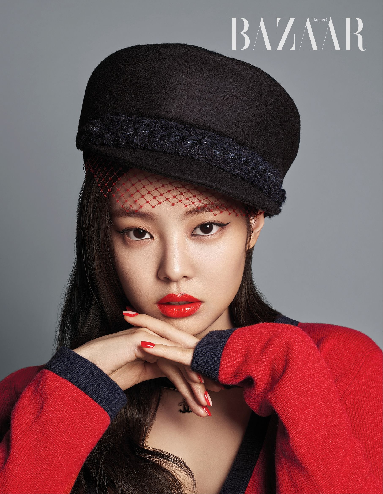
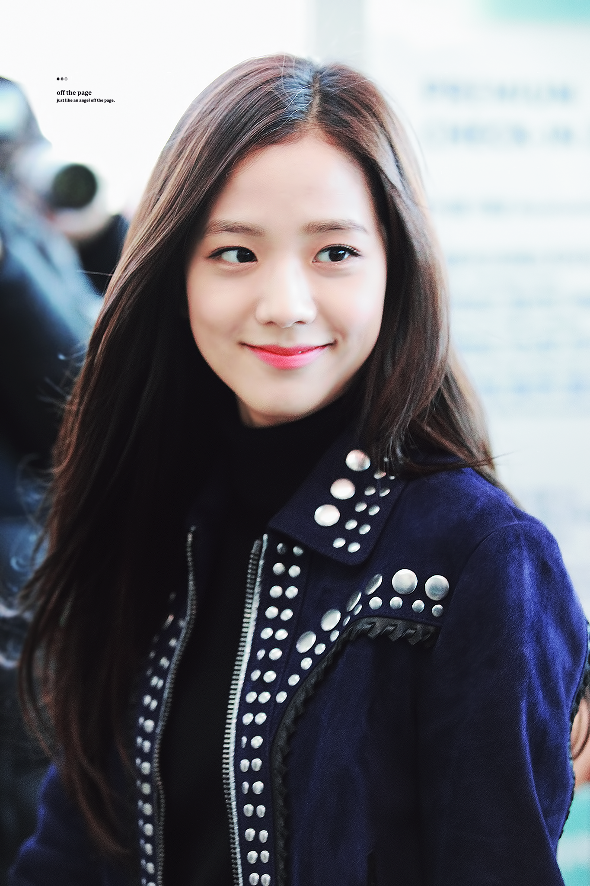

# Blackpink-member-recognition-using-CNN

This project trains a convolutional neural network to classify images of the members of Blackpink - `Jennie`, `Rosé`, `Lisa` and `Jisoo`.

    
    
    
    

The repository contains two files:
- blackpink.py ( which can be run locally)
- blackpinkcolab.py (which can run on google colab)

## Data

The data was scraped from reddit using [Reddit Media Scraper](https://github.com/anand-kamble/Reddit-Media-Scraper)
The training and test data consists of images of the 4 Blackpink members in subfolders under the main `data` folder:

- jennie (contains 2000 images)
- lisa (contains 937 images)
- Rosé (contains 952 images)
- jisoo (contains 1329 images)

Since the whole dataset is quite huge it cannot be uploaded on github but it can be viewed on my google drive.
This [data](https://drive.google.com/drive/folders/1dR09nc9nZX4G0WPRP5B9EndtirI2WnFg?usp=sharing) was used to train the model

The folder structure is important for the image generator to work properly.

## Model 

The model is a convolutional neural network built with Keras using the Tensorflow backend, consisting of:

- 3 Convolutional layers
- 3 Max pooling layers
- 3 Dense layers 
- Softmax output layer

## Training

The model was trained for 75 epochs with the following parameters:

- Batch size: 32
- Learning rate: 0.01 
- SGD optimizer with momentum of 0.9
- Categorical crossentropy loss
- Image augmentation (rotation, shifts, shear, zoom, horizontal flip)

Early stopping was used to cancel training if accuracy reached 95%.

The trained model achieved 83% percent accuracy while training for 75 epochs and is saved to `blackpink_trained_model.h5`.
Note: The notebooks and the code deployed shows 25 epoch because for google colab and local testing at that time had only trained it for 25 epochs for testing the pipeline.
The local blackpink.py after that was trained for 75 epochs locally and it gave accuracy of around 83%

## Testing

After training, the model can be loaded and used to predict Blackpink members in new test images. Some sample predictions are shown on test images from the `testing_blackpink` folder.
The output includes the predicted member, confidence scores per member, and index of predicted member. The test image is also displayed using matplotlib.
It was observed that since `jennie's` data was twice i.e 2000 images than that of other members the model was overfitting and misclassifiying other members as `jennie`. This can be fixed
by adding more images of `jisoo`,`Rosé` and `lisa` and retraining the model and hyperparamerter tuning

This was my first deep learning project after gaining some knowledge of deep learning and got to know about many things like how Conv2D works , 
what happens when we tweak the parameter like  `tf.keras.layers.Conv2D(64,(3,3),activation='relu')`,
`tf.keras.layers.MaxPooling2D(2,2)`, `tf.keras.layers.Dense(512,activation='relu')` and got to learn a lot from this project. 
How does learning rate affect the model, how changing Conv2D parameters affect the results, SGD, activation function (relu,tanh) ,etc. How each parameter affects
the model output and most importantly what mistakes I made while using Conv2D and Dense layer and how to use those correctly and other hyperparameter tuning.

## Usage

To use this model on your own images:

1. Save your images of Blackpink members in separate test folders per member 
2. Load trained model
3. Make predictions using model.predict()  
4. Display and check results
   
